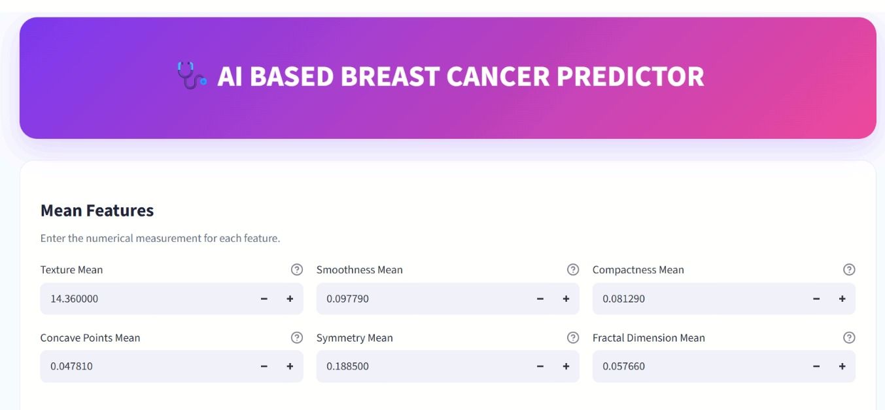
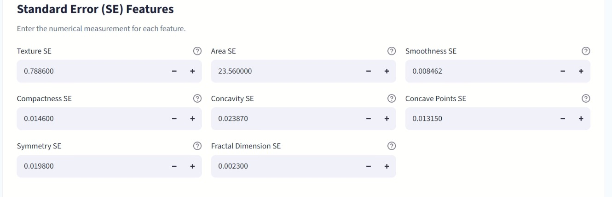
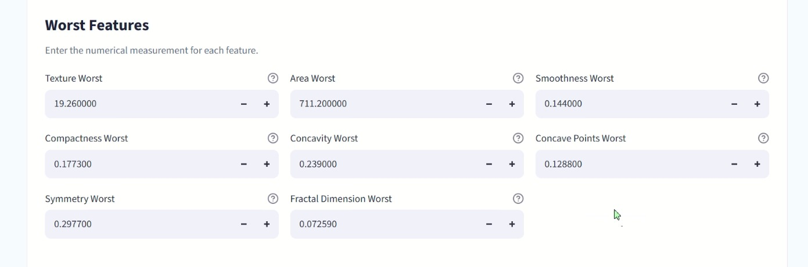
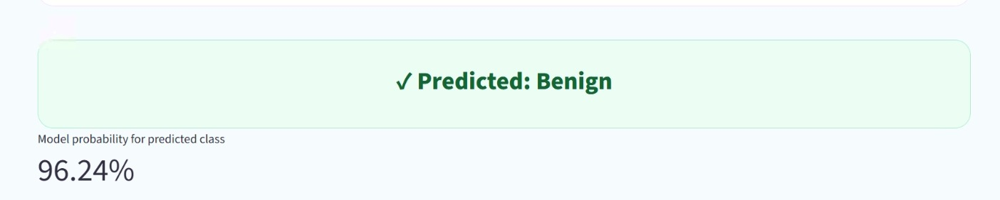

# AI Based Breast Cancer Predictor

## 1. Introduction / Overview

The **AI Based Breast Cancer Predictor** is a machine learning project developed to predict whether a breast tumor is **benign** or **malignant** based on numerical measurements of cell nuclei.

The project uses the Breast Cancer dataset and follows a complete machine learning workflow. The data is first explored and cleaned, followed by feature selection, data scaling, model training, hyperparameter tuning, and performance evaluation.

Several machine learning algorithms were tested, including Logistic Regression, K-Nearest Neighbors (KNN), Support Vector Machine (SVM), Decision Tree, Random Forest, Gradient Boosting, and XGBoost.

Among the models tested in the project, the **Support Vector Machine (SVM)** achieved the highest test accuracy of **98.25%**. Therefore, the SVM model was selected as the final model and saved in `breast_cancer.pkl`.

A Streamlit-based frontend was also created for the project. It allows the user to enter the required 22 feature values and receive a prediction from the trained model.

---

## 2. Objective

The main objectives of this project are:

- To analyze breast cancer data using Python and machine learning techniques.
- To understand the relationship between different features in the dataset.
- To identify and remove highly correlated features.
- To preprocess and scale the data before model training.
- To train and compare multiple machine learning classification algorithms.
- To tune the Support Vector Machine model using GridSearchCV.
- To select the model with the best test performance.
- To save the final model, scaler, and feature list for future predictions.
- To develop a simple frontend where users can enter feature values and obtain a breast cancer prediction.

---






## 3. Project Structure

The project contains the following main files:

```text
AI-Based-Breast-Cancer-Predictor/
│
├── Breast Cancer Prediction Project.ipynb
├── breast_cancer.pkl
├── app.py
├── requirements.txt
├── README.md
└── data.csv
```

### File Description

**`Breast Cancer Prediction Project.ipynb`**

This is the main Jupyter Notebook containing the complete machine learning workflow. It includes data processing, exploratory data analysis, feature selection, model training, model evaluation, hyperparameter tuning, and model saving.

**`data.csv`**

This is the dataset used for training and testing the machine learning models.

**`breast_cancer.pkl`**

This file contains the final trained SVM model along with the `StandardScaler` and the list of features used by the model. The frontend loads these components to make predictions.

**`app.py`**

This is the Streamlit frontend of the project. It provides input fields for the 22 features required by the trained model and displays the prediction.

**`requirements.txt`**

This file contains the Python libraries required to run the project.

**`README.md`**

This file provides information about the project, its requirements, setup process, and results.

---

## 4. Requirements

### Software Requirements

The following software is required to run the project:

- Python 3.x
- Jupyter Notebook or JupyterLab
- Visual Studio Code (recommended, but optional)
- A web browser
- Streamlit for running the frontend

### Python Libraries

The Jupyter Notebook uses the following Python libraries:

- pandas
- numpy
- matplotlib
- seaborn
- missingno
- scikit-learn
- xgboost

The frontend additionally uses:

- streamlit

### Install the Required Libraries

Open a terminal in the project folder and run:

```bash
pip install pandas numpy matplotlib seaborn missingno scikit-learn xgboost streamlit
```

You can also install the libraries listed in `requirements.txt` using:

```bash
pip install -r requirements.txt
```

### Dataset Requirement

Make sure `data.csv` is available in the same project environment when running the Jupyter Notebook because the notebook loads the dataset using:

```python
pd.read_csv("data.csv")
```

### Model Requirement

The `breast_cancer.pkl` file should be present in the same folder as `app.py`.

The saved file contains:

- Trained SVM model
- StandardScaler
- 22 model feature names

---

## 5. How to Run the Project

### Step 1: Open the Project

Open the complete project folder in Visual Studio Code or another Python development environment.

Make sure the required files are present:

```text
app.py
breast_cancer.pkl
requirements.txt
README.md
```

If you want to run the complete machine learning workflow again, also make sure:

```text
Breast Cancer Prediction Project.ipynb
data.csv
```

are available.

### Step 2: Install the Requirements

Open the VS Code terminal and run:

```bash
pip install -r requirements.txt
```

### Step 3: Run the Jupyter Notebook

Open:

```text
Breast Cancer Prediction Project.ipynb
```

in Jupyter Notebook, JupyterLab, or VS Code.

Run the notebook cells in order to perform data preprocessing, feature selection, model training, evaluation, and model saving.

The notebook saves the final model as:

```text
breast_cancer.pkl
```

### Step 4: Run the Frontend

The frontend is built using Streamlit, so it should not be started using the normal Python **Run** button.

Open the terminal in the folder containing `app.py` and run:

```bash
streamlit run app.py
```

Streamlit will provide a local address, normally:

```text
http://localhost:8501
```

Open this address in a web browser.

### Step 5: Enter the Input Values

The frontend accepts the following 22 features:

```text
texture_mean
smoothness_mean
compactness_mean
concave_points_mean
symmetry_mean
fractal_dimension_mean
texture_se
area_se
smoothness_se
compactness_se
concavity_se
concave_points_se
symmetry_se
fractal_dimension_se
texture_worst
area_worst
smoothness_worst
compactness_worst
concavity_worst
concave_points_worst
symmetry_worst
fractal_dimension_worst
```

The entered values are arranged in the same order as the trained model, scaled using the saved `StandardScaler`, and then passed to the saved SVM model.

---

## 6. Result

In this project, seven classification algorithms were trained and evaluated on the test dataset.

| Model | Test Accuracy |
|---|---:|
| Logistic Regression | 96.49% |
| KNN | 95.61% |
| SVM | **98.25%** |
| Decision Tree Classifier | 91.23% |
| Random Forest Classifier | 97.37% |
| Gradient Boosting Classifier | 95.61% |
| XGBoost | 97.37% |

The **SVM model achieved a test accuracy of 98.25%** and was selected as the final model used by the frontend.

The trained model was saved in `breast_cancer.pkl` together with the scaler and the 22 feature names. The frontend successfully uses these saved components to generate predictions for new input values.

The model can produce two classes:

- **Benign**
- **Malignant**

The final Streamlit dashboard provides a simple interface where users can enter all 22 required feature values and receive the model's prediction.
